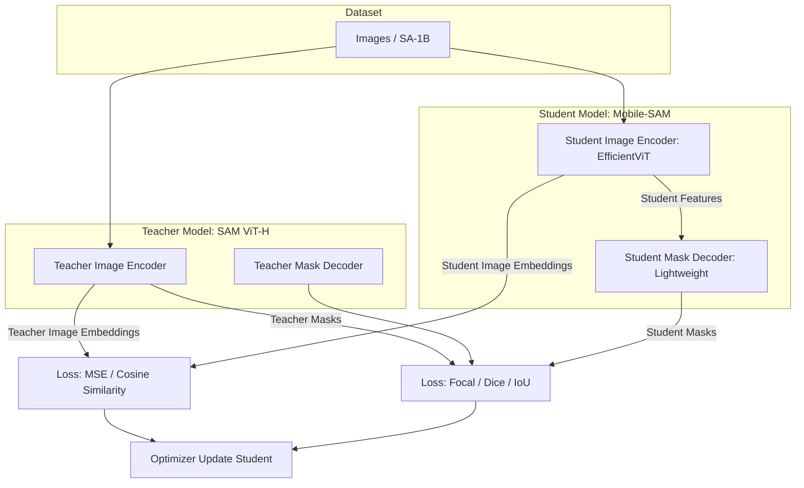

# Architecture Design — Mobile-SAM SDK

This document defines the system architecture, inference pipeline, and edge-device optimization strategy for the Mobile-SAM SDK.

## 1. Distillation pipeline
We move knowledge from the teacher (SAM ViT-H) into a lightweight student (EfficientViT / MobileNetV3-based).

## 2. Inference pipeline & tracking integration
To work around mobile compute budgets, we run the heavy `Image Encoder` only on keyframes; intermediate frames are handled by the `Tracker` (ByteTrack) and the cheap `Mask Decoder`.

1. **Keyframe processing (1–2 times per second)**
   - Input image → `Image Encoder` → image embedding (15–25 ms)
   - User input (point / box) → `Prompt Encoder` → prompt embedding (< 1 ms)
   - Image & prompt embeddings → `Mask Decoder` → mask + bounding box (3–5 ms)
2. **Inter-frame tracking (every other frame)**
   - Previous BBox → `ByteTrack` (Kalman + IoU / ReID) → predicted BBox (< 2 ms)
   - Use the predicted BBox as the prompt → `Prompt Encoder`
   - Downscaled features of the current frame + prompt → `Mask Decoder` → updated mask (3–5 ms)

## 3. Per-platform inference backends

| Platform | Target API / Backend | Quantization | Hardware acceleration | Notes |
|---|---|---|---|---|
| **iOS / iPadOS** | CoreML | FP16 / W8A16 | Apple Neural Engine (ANE) + GPU | iOS 16+, A14 Bionic or newer recommended. ANE dramatically speeds up the Image Encoder. |
| **Android** | TFLite | INT8 (Post-Training) | GPU Delegate / NNAPI / XNNPACK | Tap Pixel / Snapdragon Hexagon DSP and Adreno GPU. XNNPACK fallback is mandatory to absorb compatibility issues. |
| **Web** | ONNX Runtime Web | FP16 / INT8 | WebGPU (WASM fallback) | Chrome 113+. WebGPU compute shaders give near-native FPS in the browser. |

## 4. Model conversion flow (export & conversion)
The conversion path from PyTorch to each edge format is automated in CI/CD.

1. **PyTorch → ONNX**: `torch.onnx.export` (opset 17). Replace dynamic batch / variable resolution with a static graph by shipping multiple fixed-size models (e.g. 512×512, 1024×1024).
2. **ONNX → CoreML**: `coremltools` produces `.mlpackage`. `compute_units=CTComputeUnitsAll` enables hybrid ANE + GPU execution.
3. **ONNX → TFLite**: `onnx2tf` (or `tf.lite.TFLiteConverter`). PTQ (Post-Training Quantization) with a representative dataset for INT8.

## 5. Targets

| Metric | Target | Baseline / Competitor |
|---|---|---|
| **Model size** | **< 15 MB** (Image Encoder + Decoder) | SAM ViT-H: 2.4 GB / SAM2-T: ~50 MB |
| **FPS (iPhone 13)** | **> 30 FPS** (tracking) / > 15 FPS (full) | Original SAM: < 1 FPS (CPU) |
| **FPS (Pixel 6)** | **> 25 FPS** (tracking) | Original SAM: OOM |
| **FPS (WebGPU on M1)** | **> 40 FPS** | Web Worker + ONNX CPU: ~2 FPS |
| **Accuracy (IoU)** | **> 80%** (DAVIS 2017 val) | Original SAM: ~86% |
| **Latency (Decoder)** | **< 5 ms** | - |
