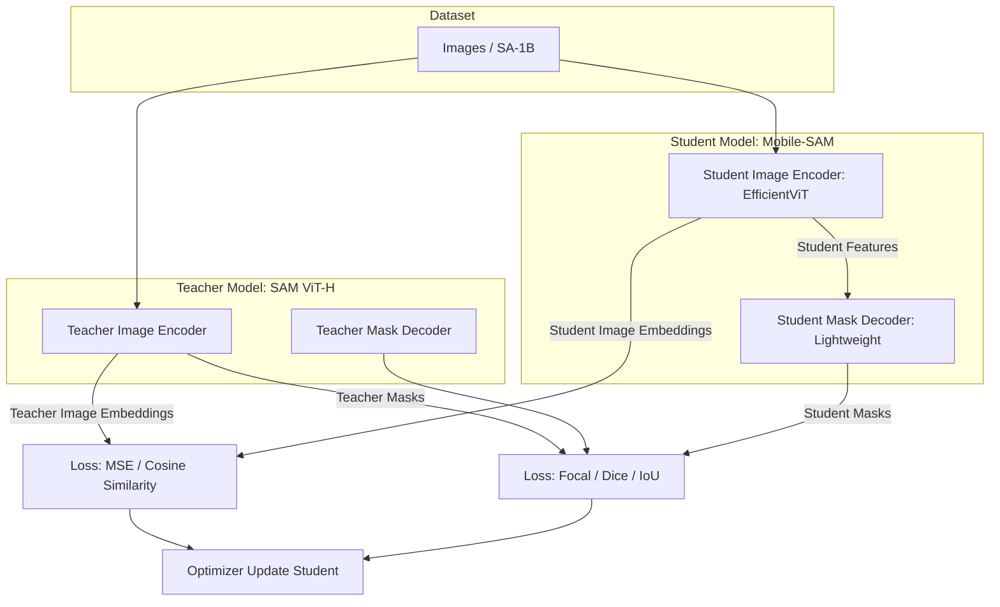

# Architecture Design: Mobile-SAM SDK

本ドキュメントは、Mobile-SAM SDKのシステムアーキテクチャ、推論パイプライン、およびエッジデバイス向けの最適化戦略を定義する。

## 1. 蒸留パイプライン (Distillation Pipeline)
教師モデル（SAM ViT-H）の知識を軽量な生徒モデル（EfficientViT / MobileNetV3ベース）へ移行するための蒸留パイプライン。

## 2. 推論パイプライン & トラッキング統合
モバイル環境の計算リソース制約を回避するため、`Image Encoder`（重い処理）の実行をキーフレームのみに限定し、中間フレームは`Tracker`（ByteTrack）と`Mask Decoder`（軽い処理）で補完する。

1. **Keyframe Processing (毎秒1〜2回実行)**
   - 入力画像 → `Image Encoder` → Image Embedding生成 (15-25ms)
   - ユーザー入力 (Point/Box) → `Prompt Encoder` → Prompt Embedding生成 (<1ms)
   - Image & Prompt Embeddings → `Mask Decoder` → Mask生成 & Bounding Box (BBox) 抽出 (3-5ms)
2. **Inter-frame Tracking (それ以外の全フレームで実行)**
   - 前フレームのBBox → `ByteTrack` (Kalman Filter + IoU/ReID) → 現フレームのBBox予測 (<2ms)
   - 予測BBoxをPromptとして利用 → `Prompt Encoder`
   - 現フレームをダウンスケールした簡易特徴量 + Prompt → `Mask Decoder` → 新規Mask生成 (3-5ms)

## 3. プラットフォーム別 推論バックエンド比較

| Platform | Target API / Backend | Quantization | Hardware Acceleration | Note |
|---|---|---|---|---|
| **iOS / iPadOS** | CoreML | FP16 / W8A16 | Apple Neural Engine (ANE) + GPU | iOS 16+, A14 Bionic以降推奨。ANEによるImage Encoderの劇的な高速化。 |
| **Android** | TFLite | INT8 (Post-Training) | GPU Delegate / NNAPI / XNNPACK | Pixel/SnapdragonのHexagon DSPやAdreno GPUを活用。相性問題回避のためXNNPACKへのフォールバック実装必須。 |
| **Web** | ONNX Runtime Web | FP16 / INT8 | WebGPU (WASM fallback) | Chrome 113以降。WebGPUのCompute Shaderによりブラウザ上でネイティブに近いFPSを実現。 |

## 4. モデル変換フロー (Export & Conversion)
PyTorchから各エッジフォーマットへの変換は以下のパイプラインを自動化(CI/CD)する。

1. **PyTorch -> ONNX**: `torch.onnx.export` (opset 17)。動的バッチサイズと可変解像度を固定サイズ（例: 512x512, 1024x1024）のマルチモデル化で静的グラフに落とす。
2. **ONNX -> CoreML**: `coremltools` を使用し、`.mlpackage` に変換。`compute_units=CTComputeUnitsAll`でANE/GPUハイブリッド実行を有効化。
3. **ONNX -> TFLite**: `onnx2tf` (または `tf.lite.TFLiteConverter`) を使用。Representative Datasetを用いたPTQ (Post-Training Quantization) でINT8化。

## 5. 目標数値 (Target Metrics)

| Metric | Target Value | Baseline / Competitor |
|---|---|---|
| **Model Size** | **< 15 MB** (Image Encoder + Decoder) | SAM ViT-H: 2.4 GB / SAM2-T: ~50MB |
| **FPS (iPhone 13)** | **> 30 FPS** (Tracking時) / > 15 FPS (Full) | Original SAM: < 1 FPS (CPU) |
| **FPS (Pixel 6)** | **> 25 FPS** (Tracking時) | Original SAM: OOM (Out of Memory) |
| **FPS (WebGPU - M1)** | **> 40 FPS** | Web Worker + ONNX CPU: ~2 FPS |
| **Accuracy (IoU)** | **> 80%** (DAVIS 2017 val) | Original SAM: ~86% |
| **Latency (Decoder)** | **< 5 ms** | - |
